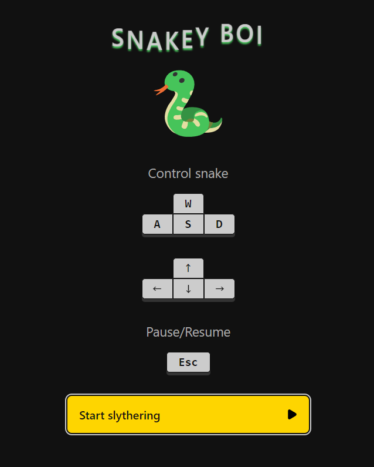

# Snakey-boi

The iconic snake game made from scratch in ReactJS.
Control the snake to eat, grow longer, and try to achieve the highest score possible!

[Visit](https://snakey-boi.vercel.app/)

## Features

- Classic Snake gameplay
- Adjustable speed settings (slow, normal, fast, super sonic)
- Highscore tracking
- Game state persistence using `localStorage`
- Responsive design for different screen sizes

## Upcoming features

- Progression
- Power-ups

##### Credit

- All icons taken from [SVGRepo](https://www.svgrepo.com/)
- [Swiped events](https://github.com/john-doherty/swiped-events) library used to easily support touchscreen controls.
